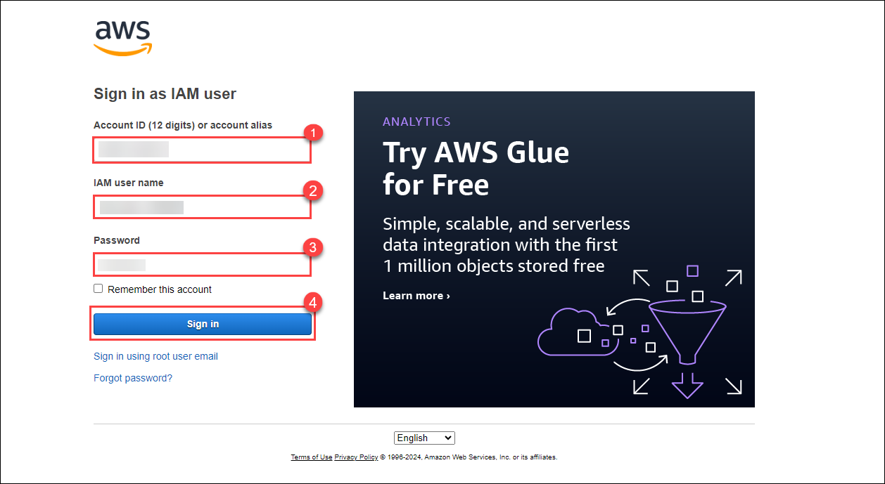
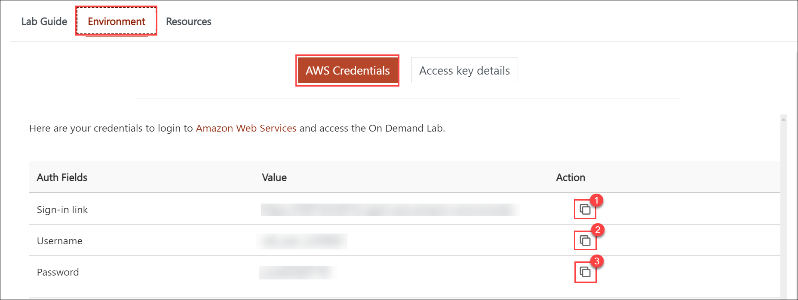

# AWS Lab – Load Balancer with Auto Scaling Group

**Before starting the hands-on lab, kindly note that the lab duration will be shown at the top right corner of your lab environment page once the lab is launched by clicking the **Launch Lab** button. The time will be ticking automatically, so it's important to keep an eye on it while performing your lab tasks.**

---

## ⏱️ Approximate Duration
This lab will take **~1.5 hours** to complete.

---

## 📋 Prerequisites
Before starting, ensure you are familiar with:
- Basics of **AWS Management Console** navigation.
- Concepts of **EC2 instances**, **VPC networking**, and **security groups**.
- Basic knowledge of **Load Balancers** and **Auto Scaling**.
- Using **User Data scripts** to configure web servers.

---

## 🔎 Lab Overview
In this lab, you will build a **highly available web application setup** using an **Application Load Balancer (ALB)** and an **Auto Scaling Group (ASG)**.

The lab consists of 4 modules:

1. **Creating a Launch Template** – Provision EC2 instances with a preconfigured Apache web server.  
2. **Configuring a Load Balancer** – Deploy an Application Load Balancer (ALB) with a Target Group for traffic distribution.  
3. **Setting up an Auto Scaling Group (ASG)** – Automate scaling of EC2 instances to ensure availability and resilience.  
4. **Validation** – Test the load balancer DNS and validate ASG behavior by terminating instances.

By the end of this lab, you will understand how to deploy scalable and highly available applications on AWS using ALB + ASG.

---

## 🚀 Getting Started

Follow the steps below to get started with the lab.

1. Sign in to the AWS Management Console by copying the **Sign-in link, Username, and Password** provided below.

    * **Sign-in Link**: **<inject key="SignInUrl" enableCopy="true" />**

    * **IAM Username**: **<inject key="UserName" enableCopy="true" />**

    * **Password**: **<inject key="Password" enableCopy="true" />**

    

    Alternatively, you can also find these values on the **CloudLabs** Environment tab.

    

2. After signing in to the AWS Management Console, choose the region **US-EAST-1 (N. Virginia)** from the dropdown menu.

    

**Note:** You can deploy the resources in any of the six regions mentioned below:

*  **us-east-1 (N. Virginia)**
*  **us-east-2 (Ohio)**
*  **us-west-2 (Oregon)**
*  **eu-central-1 (Frankfurt)**
*  **eu-west-2 (London)**
*  **ap-southeast-1 (Singapore)**
