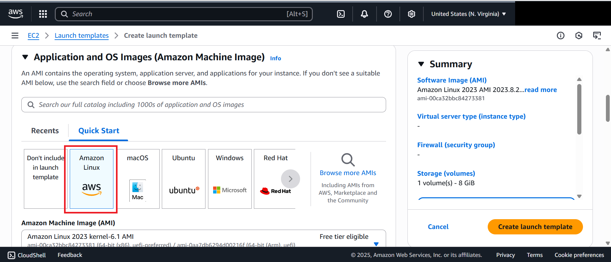
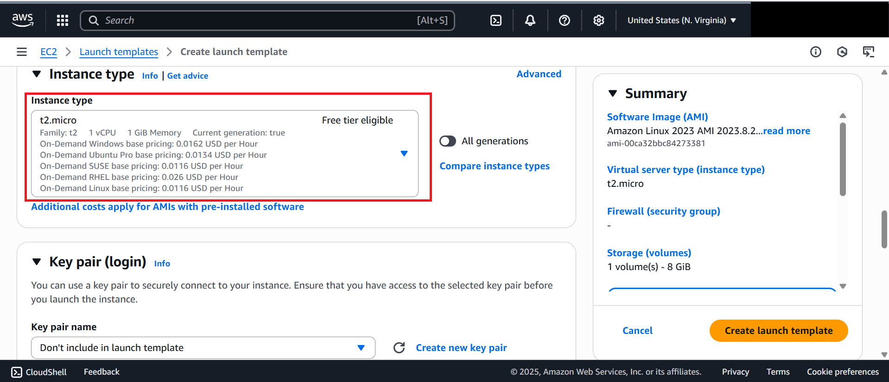

# Lab 1: Creating a Launch Template

## 📝 Overview – Launch Template

A **Launch Template** in AWS defines the configuration of EC2 instances that can be launched automatically or through Auto Scaling Groups.  
It allows you to predefine settings such as:

- **AMI (Amazon Machine Image)** for the OS and base configuration  
- **Instance type** (e.g., t2.micro)  
- **Key pairs, Security groups, and Networking details**  
- **User Data scripts** to install software automatically at launch  

Using Launch Templates ensures **consistency and automation** when provisioning instances.

In this lab, we will create a **Launch Template** that provisions EC2 instances with a web server enabled via User Data.

---

## Steps

1. **Navigate to Launch Templates**
   - Search for **EC2** in the AWS Management Console.
     
   - Under **Instances**, select **Launch Templates**.
   - Click **Create new launch template**.  
   

2. **Configure Template**
   - Enter **Launch Template Name**: `server-template`
   - (Optional) Add a description: *This template enables a web server on the EC2.*  
   

3. **Select AMI & Instance Type**
   - **AMI**: Amazon Linux
   - **Instance Type**: `t2.micro`  
   
   

4. **Add User Data**
   - Scroll to **Advanced Details** → expand → go to **User data** section.
    
   - Paste the following script to install Apache web server:

   ```bash
   #!/bin/bash
   sudo yum install -y httpd 
   sudo systemctl start httpd
   sudo systemctl enable httpd
   echo "Hello from $(hostname)" | sudo tee /var/www/html/index.html
