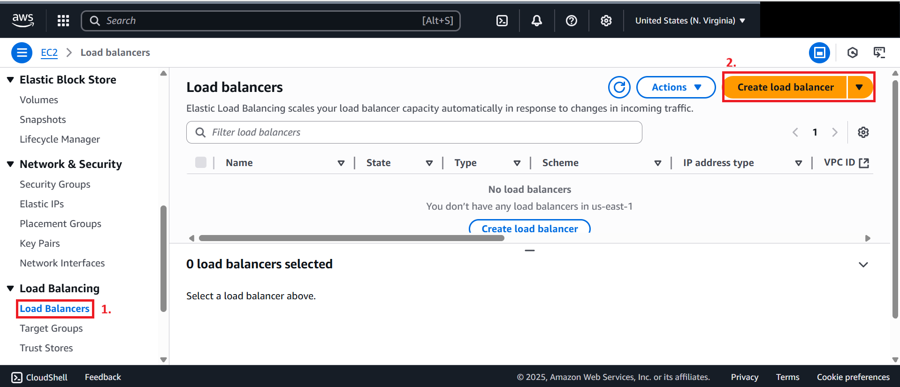
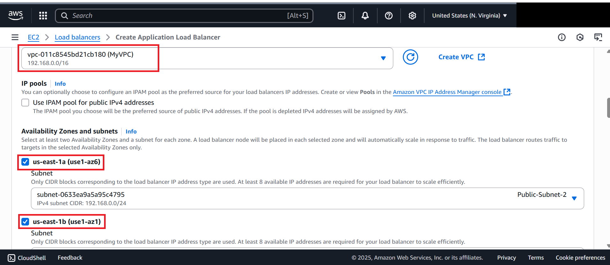
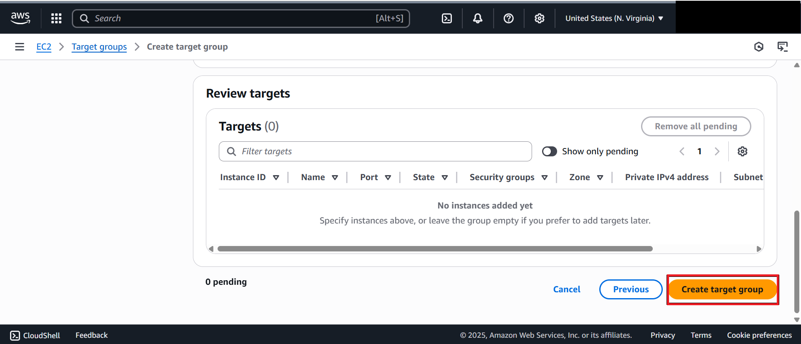

# Lab 2: Creating an Application Load Balancer

## 📝 Overview – Load Balancer

An **Application Load Balancer (ALB)** distributes incoming traffic across multiple EC2 instances to improve **availability** and **scalability**.  

Key features of ALB:
- Operates at **Layer 7 (HTTP/HTTPS)** of the OSI model  
- Can handle **routing based on content** (e.g., path-based or host-based routing)  
- Provides a **single DNS name** that users access instead of individual EC2 IPs  
- Performs **health checks** to route traffic only to healthy targets  

This ensures users always get connected to a healthy instance, even if one instance fails.

In this lab, we will create an **Application Load Balancer (ALB)** that distributes traffic across backend instances.

---

## Steps

1. **Navigate to Load Balancers**
   - In the EC2 dashboard, scroll down and select **Load Balancers**.
   - Click **Create Load Balancer**.
     
   - Select **Application Load Balancer** → click **Create**.  
   

2. **Configure ALB**
   - **Load Balancer Name**: `Server-alb`
   - **Scheme**: Internet-facing  
   

3. **Networking & Security**
   - **VPC**: `MyVPC`
   - Select **2 Availability Zones**.
   - Select the **default security group**.
   - Ensure rules allow **HTTP (80)** traffic from the internet.  
   

4. **Create Target Group**
   - In the **Target Group** section, click **Create Target Group** (new window).
     
   - **Target Type**: Instances
     
   - **Target Group Name**: `server-tg`  
   - **Protocol**: HTTP, **Port**: 80
     
   - Click **Next**
   
   - → scroll to bottom → **Create target group**.  
   

5. **Attach Target Group**
   - Go back to the load balancer creation page.
   - Refresh the **Target Group** tab and select the newly created group.
   - 
   - Click **Create Load Balancer**.
     
   
