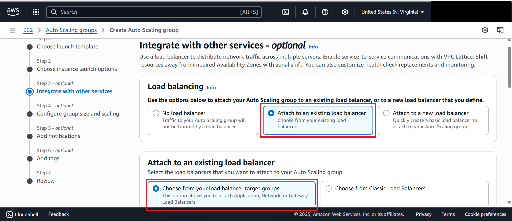
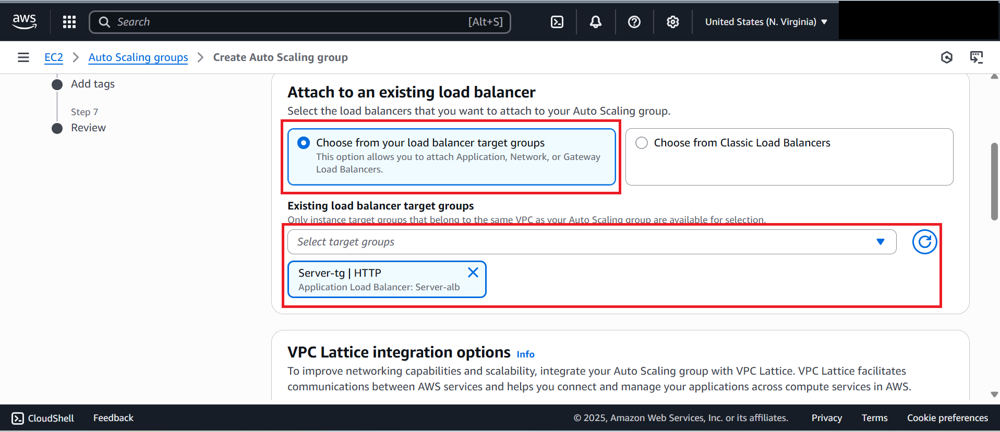
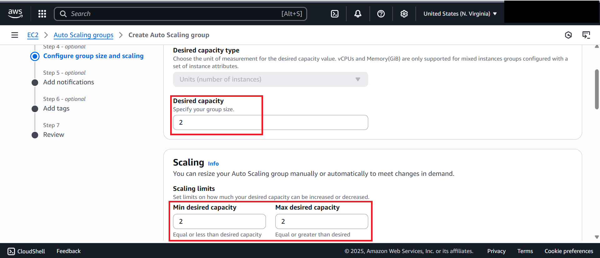

# Lab 3: Creating an Auto Scaling Group

In this lab, we will create an **Auto Scaling Group (ASG)** that launches EC2 instances using the Launch Template and attaches them to the Load Balancer.

---

## Steps

1. **Navigate to Auto Scaling Groups**
   - In the EC2 dashboard, scroll down to **Auto Scaling Groups**.
   - Click **Create Auto Scaling Group**.  
   

2. **Basic Configuration**
   - **ASG Name**: `Server-asg`
   - Select the **Launch Template** created earlier (`server-template`).  
   

3. **Networking**
   - Select **MyVPC**.
   - Choose **2 subnets / Availability Zones**.
   - Click **Next**.  
   

4. **Load Balancer Integration**
   - In the **Integrations** tab → Load Balancing section:
   - Select **Attach to an existing load balancer**.
   
   - Choose the previously created **Target Group (`server-tg`)**.
   - 
   - Click **Next**.  
   

5. **Group Size & Scaling**
   - Desired Capacity: **2**
   - Minimum Capacity: **2**
   - Maximum Capacity: **2**  
   

6. **Notifications (Optional)**
   - Add SNS notifications to monitor instance launches/terminations.
   - Create a topic:
     - Name: `my-sns-server`
     - Add your email address.  
   
   - Click **Create Auto Scaling Group**.
   - Wait 2–3 minutes for instances to spin up and register with the Load Balancer.

