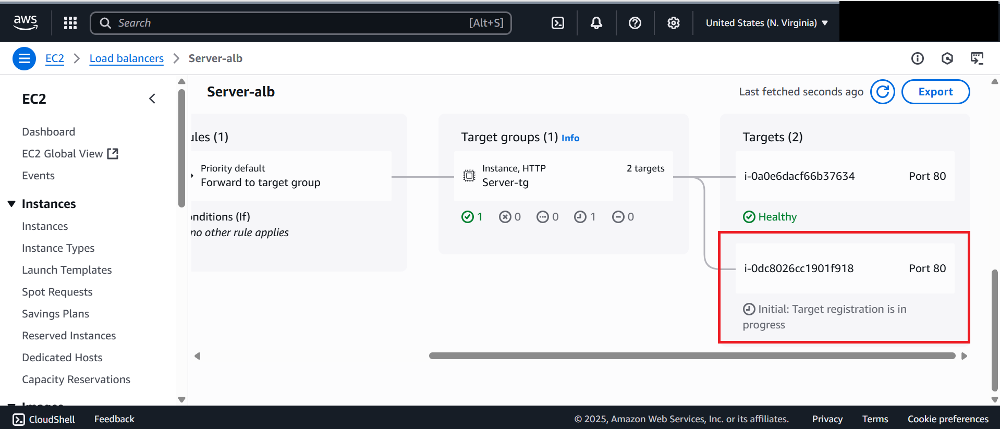

# Lab 4: Validation of Load Balancer and Auto Scaling Group

In this lab, we will validate the **Load Balancer** and the **Auto Scaling Group** setup.

---

## Steps

### Validate Load Balancer
1. Navigate to the **Load Balancer** page.
2. Copy the **DNS name** of the ALB.
   
3. Paste into a browser → refresh multiple times.
   - You should see responses alternating between **two EC2 instances** running web servers.  
   
   

---

### Validate Auto Scaling Group
1. Scroll down to the **Resource Map Target Instances** section in Load balancer page.
   
2. Terminate one instance.
3. 
4. Wait 2–3 minutes → ASG will **recreate the instance** to maintain desired capacity.  
   
5. Observe:
   - While one instance is down, traffic is routed to the other.
   - Once the new instance is healthy, traffic is balanced between both servers.
   - If any instance fails, the ASG provisions a replacement automatically.
   - Navigate to load balancer page and in the resources map you can see the instances are healthy.
   
